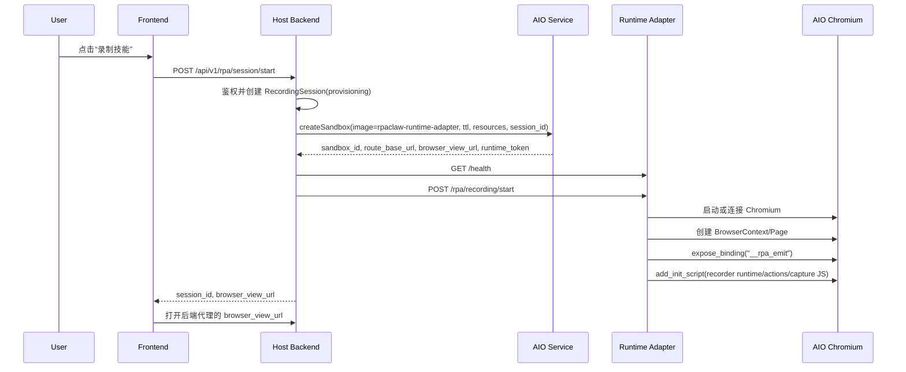
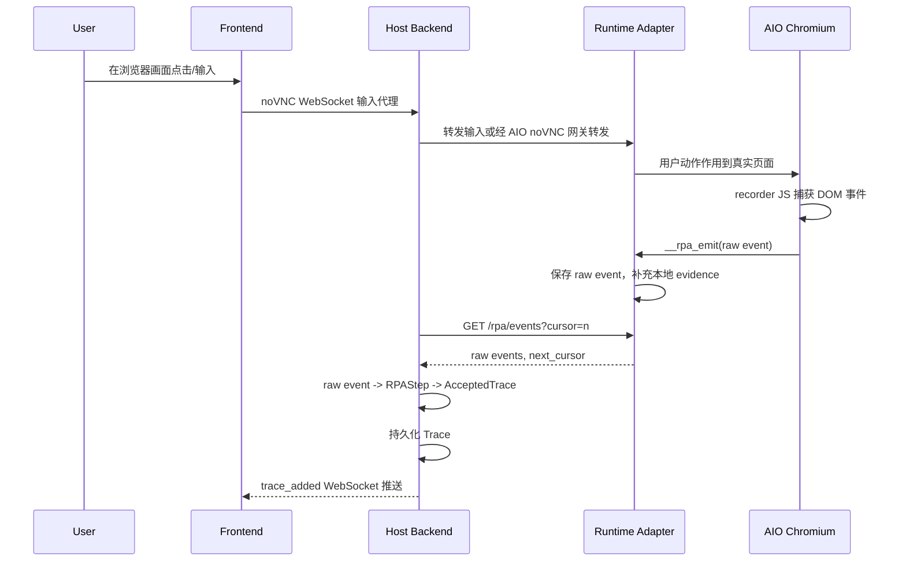
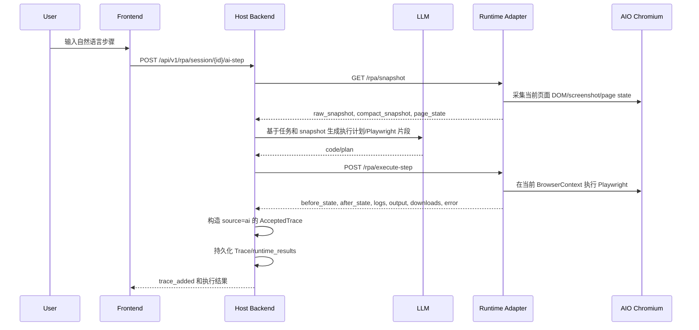
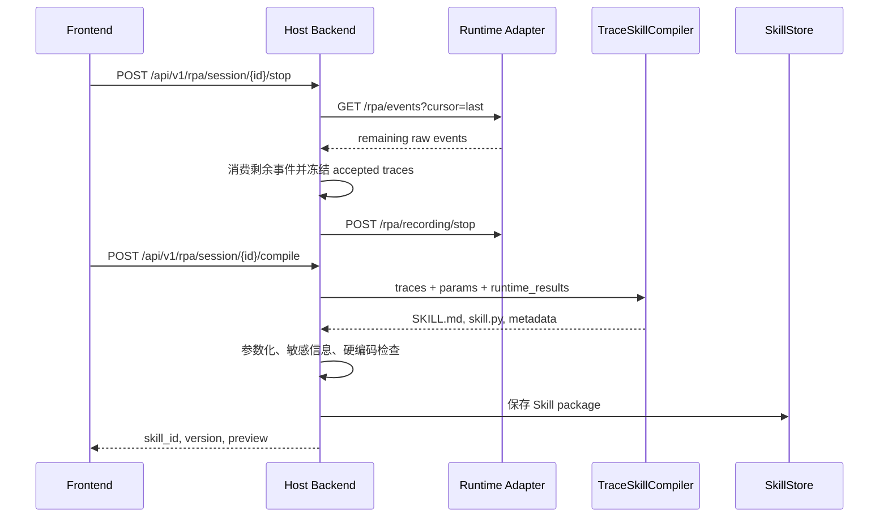
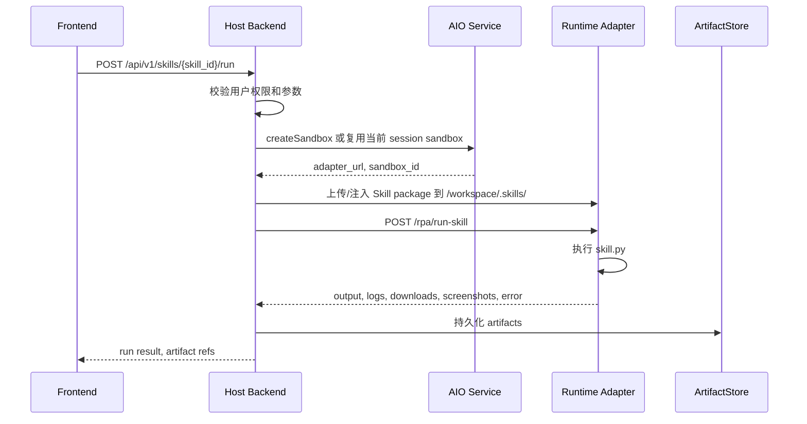
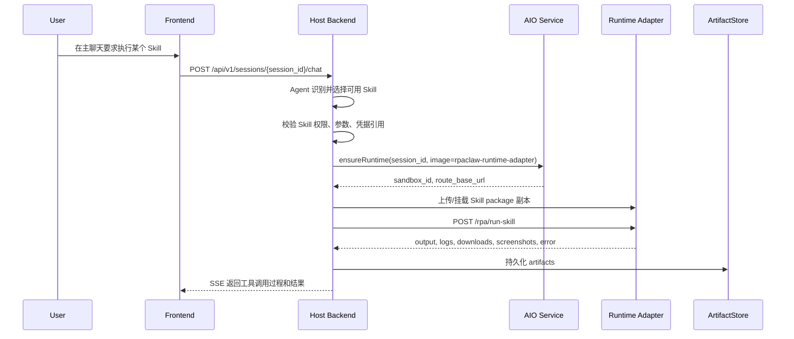
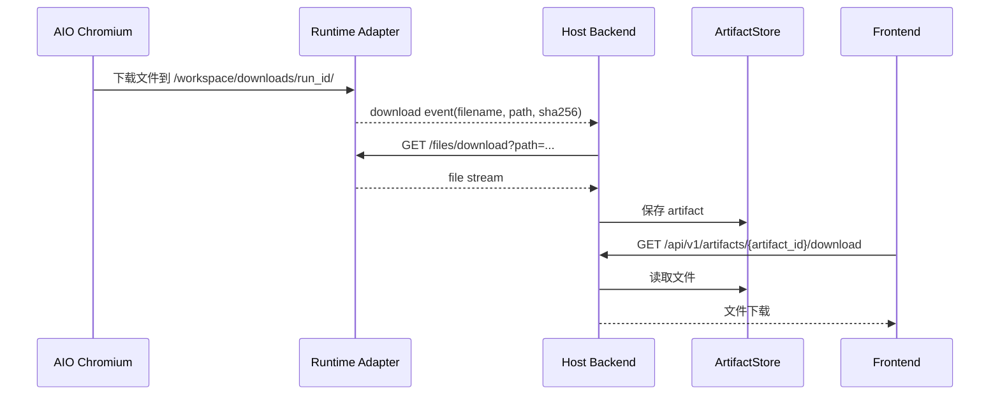

# AIO 会话级沙箱与 Runtime Adapter 设计草案

## 1. 背景与目标

本文面向后续内网 Agent 落地开发，描述如何把当前偏本地模式的 RPA 录制与回放链路，迁移为“每个用户会话一个 AIO 沙箱”的隔离架构。

当前外网/本机无法直接访问真实 AIO create/status/delete、镜像发布和内网路由能力，也不应该为了“看起来完整”而重写一套 AIO 调度平台。外网阶段的重点是提前收敛 Host 与执行面之间的架构边界、runtime record 抽象、adapter semantic API、token/ready/error 诊断、workspace/skill/artifact 闭环和脱敏日志策略；这些能力与真实 AIO 字段名和部署路径弱相关，可以在本机通过固定沙箱、fake AIO lifecycle 和 adapter smoke 提前验证。

因此，本文把外网可验收范围和内网最终验收范围分开：外网验证的是 Host Backend 如何把 AIO Sandbox/Runtime Adapter 当作不可信执行面来调用、诊断和回收；内网验证的是真实 AIO API 字段、镜像仓库、沙箱路由、浏览器/CDP 稳定性和真实资源释放。同步到内网后，Agent 应优先替换真实 AIO create/status/delete 字段与路径、配置并发布 adapter 镜像、运行 `aio_real` smoke，再基于真实环境差异做少量收口迭代，而不是重新推翻控制面/执行面的边界。

目标不是把完整 RpaClaw 后端搬进沙箱，而是建立清晰边界：

```text
Host Backend = 可信控制面
AIO Sandbox = 不可信执行面
```

控制面负责鉴权、会话归属、Trace 接受与持久化、Skill 编译、资产治理、Artifact 持久化和审计。执行面负责浏览器、Playwright、脚本执行、文件处理、下载、截图、临时日志与 raw evidence 采集。

后续假设：

- AIO 服务提供完整字节开源 AIO v160 能力。
- AIO 平台服务和 AIO 团队维护的基础能力不改造，RpaClaw 只通过 AIO 官方 API 接入。
- AIO create sandbox API 支持指定用户 runtime adapter 镜像，并由 AIO 平台负责启动该镜像。
- RpaClaw runtime adapter 镜像内可以常驻运行 adapter 服务、Chromium/Playwright 依赖、recorder JS assets、Skill replay runner 和文件处理工具。
- Host Backend 可以通过 AIO 返回的 `sandbox_id`、路由入口或内网地址访问 adapter HTTP/WebSocket API。
- 内网前端、Host Backend 等模块按 EKS 微服务多实例部署；因此 Host 侧 runtime lifecycle 不能依赖单进程内存状态或进程内锁，必须通过共享持久化 record、`session_id` 唯一身份、幂等/恢复逻辑和 AIO status refresh 来收敛同 session 的并发 ensure/create。

如果任一假设不成立，应先退回到“Host Backend 直接适配 AIO 原生 browser/shell/file API”的方案，而不是把控制面塞进沙箱。

关键约束：

```text
AIO Platform = 不改造，继续使用 AIO 团队提供的平台服务
RpaClaw Runtime Adapter Image = RpaClaw 维护，可由 AIO 平台按会话启动
Host Backend = 可信控制面，调用 AIO API 创建、路由、续期、销毁沙箱
```

因此，本文中的“自定义镜像”特指 AIO 平台允许用户指定的 runtime adapter 镜像，不是 fork 或重打 AIO 平台镜像。不要为了 RpaClaw 的执行语义修改 AIO 平台服务；如果 adapter 镜像无法承载某项能力，应优先评估是否通过 AIO 官方原生 API 适配，而不是扩大到 AIO 平台改造。

## 2. 核心边界

### 2.1 放在 Host Backend 的能力

以下能力属于可信控制面，不应进入 AIO 沙箱：

- 用户认证、权限判断、session ownership。
- AIO 沙箱创建、续期、销毁、TTL 管理。
- 用户模型配置、模型密钥、凭据库、数据库连接。
- LLM planner 调用与审计。
- AcceptedTrace 接受、排序、归一化、持久化。
- TraceSkillCompiler 编译 `SKILL.md` 与 `skill.py`。
- Skill metadata、版本、权限、持久化。
- Artifact 登记、持久化、下载代理。
- Harness 资产治理、回归报告、人工审查、promotion。

控制面是真源。AIO 只能产生 raw event、snapshot、截图、下载文件、执行日志等 evidence。

### 2.2 放在 AIO Sandbox 的能力

以下能力属于不可信执行面，应进入每会话 AIO 沙箱：

- Chromium/headful browser。
- Playwright/CDP 连接与 BrowserContext/Page 管理。
- recorder JS 注入与 raw event 捕获。
- 自然语言步骤生成的 Playwright 片段执行。
- 生成后的 `skill.py` 回放与测试。
- shell/code/tool runner。
- 第三方 Tools、外部 Skills 的实际执行。
- 文档/PDF/图片处理工具，如 LibreOffice、Pandoc、OCR 等。
- 下载目录、临时文件、截图、运行日志。
- stdio MCP server，如果其需要启动本地进程，默认也应在沙箱内运行。

执行面可持有短期 session-scoped token，但不应持有全局数据库凭据、长期模型密钥或跨用户资产访问能力。

## 3. Runtime Adapter 的定位

Runtime adapter 是运行在每个 AIO 沙箱内的轻量服务。它不是完整后端，只是会话执行代理。

它的价值是把 AIO 原生能力包装成 RpaClaw 更需要的语义 API。例如 AIO 原生能力可能是：

```text
/v1/shell/exec
/v1/file/read
/v1/browser/info
CDP endpoint
noVNC endpoint
```

RpaClaw 更需要的是：

```text
/rpa/recording/start
/rpa/events
/rpa/snapshot
/rpa/execute-step
/rpa/run-skill
/rpa/downloads
```

Adapter 负责靠近浏览器和文件系统的执行细节，Host Backend 负责产品事实和资产真源。

### 3.1 AIO Runtime Provider 对接点

当前 RpaClaw 已有 session runtime 抽象，落地 AIO 时优先新增 `AioRuntimeProvider`，而不是重写 RPA 录制、主聊天或 Skill 执行链路。

推荐对接形态：

```text
Host Backend
  -> AIO createSandbox(image=rpaclaw-runtime-adapter, session_id, ttl, resources)
  <- sandbox_id, route_base_url, browser_view_url, runtime_token

Host Backend
  -> AIO route(sandbox_id, /adapter/...)
  -> RpaClaw Runtime Adapter
  -> Chromium / Playwright / files / skill.py
```

`AioRuntimeProvider` 应负责：

- `create_runtime(session_id, user_id)`：调用 AIO 创建沙箱 API，指定 RpaClaw runtime adapter 镜像，记录 `sandbox_id` 与路由入口。
- `refresh_runtime(record)`：通过 AIO API 查询沙箱是否仍存在、是否 ready、是否即将过期。
- `delete_runtime(record)`：通过 AIO API 销毁或释放沙箱。
- `rest_base_url`：保存 Host 可访问 adapter 的路由入口；如果 AIO 要求所有请求都带 `sandbox_id` 路由，则保存 AIO 网关 URL 并由 provider/proxy 统一拼接。

这一路径的第一性原则是：AIO 平台负责调度、隔离、路由和资源生命周期；RpaClaw adapter 镜像负责执行语义；Host Backend 负责产品事实和持久化真源。

#### 3.1.1 本机 local-fixed Provider

在内网真实 AIO create/route/delete 服务可用前，本机不应为了“完整模拟 AIO 平台”而重写一套调度器。更低成本、更接近目标的做法是先启动一个固定 AIO/adapter 沙箱实例，然后让 `AioRuntimeProvider` 在 `RUNTIME_MODE=aio_fixed` 下返回这个预启动沙箱的 runtime record。

该模式的目标是验证：

```text
Host Backend -> SessionRuntimeManager -> AioRuntimeProvider
  -> adapter semantic API -> browser / Playwright / files / skill.py
```

而不是验证 AIO 平台自己的创建能力。本机 fixed sandbox provider 应满足：

- `create_runtime(session_id, user_id)` 不真实创建沙箱，只返回固定 `sandbox_id`、`route_base_url`、`browser_view_url` 和 `runtime_token`。
- `refresh_runtime(record)` 通过 adapter `/health` 判断 ready/missing；只有 health payload 的 `status` 为 `ok` 或 `ready` 且 `contract_version` 与 Host 支持的 adapter contract（当前 `v1`）匹配时才可认为 runtime ready，HTTP 200 但 `status=degraded/error` 或 contract 不匹配仍应标记 missing。
- `delete_runtime(record)` 在本机默认 no-op，避免调试时销毁共享沙箱。
- runtime record 的形状必须与未来真实 AIO provider 一致，避免 RPA、主聊天、Skill replay 或 runtime proxy 依赖本机特例。
- 该模式只用于本机开发和集成验证；内网落地时替换 provider 的 create/route/refresh/delete 实现，不应重写 Host/RPA/Chat 主链路。

推荐本机环境变量：

```powershell
$env:RUNTIME_MODE = "aio_fixed"
$env:AIO_RUNTIME_SANDBOX_ID = "local-aio-sandbox"
$env:AIO_RUNTIME_ROUTE_BASE_URL = "http://localhost:18080/adapter"
$env:AIO_RUNTIME_BROWSER_VIEW_URL = "http://localhost:18080/browser"
$env:AIO_RUNTIME_TOKEN = "<optional-session-token>"
```

如果 `AIO_RUNTIME_ROUTE_BASE_URL` 未配置，可退回使用现有 `SANDBOX_BASE_URL`，以便复用当前本地 sandbox/adapter 入口。

真实 AIO 生命周期 API 可使用 `RUNTIME_MODE=aio`。该模式由 `AioApiRuntimeProvider` 调用可配置的 create/status/delete HTTP endpoint，并把返回值映射为 `SessionRuntimeRecord`；RPA、主聊天、runtime proxy、CDP connector 和 workspace helper 仍只依赖 `SessionRuntimeRecord` 与 `RuntimeAdapterClient`，不直接耦合 AIO API schema。

```powershell
$env:RUNTIME_MODE = "aio"
$env:AIO_RUNTIME_API_BASE_URL = "https://aio.internal/api"
$env:AIO_RUNTIME_API_TOKEN = "<host-to-aio-api-token>"
$env:AIO_RUNTIME_IMAGE = "rpaclaw-runtime-adapter:dev"
$env:AIO_RUNTIME_CREATE_EXTRA_JSON = '{"resources":{"cpu":"1","memory":"2Gi"},"labels":{"app":"rpaclaw"}}'
$env:AIO_RUNTIME_ADAPTER_ENV = "RUNTIME_ADAPTER_TOKEN=<session-adapter-token>,RUNTIME_ADAPTER_DOWNLOADS_DIR=downloads"
$env:AIO_RUNTIME_CREATE_PATH = "/v1/sandboxes"
$env:AIO_RUNTIME_STATUS_PATH_TEMPLATE = "/v1/sandboxes/{sandbox_id}"
$env:AIO_RUNTIME_DELETE_PATH_TEMPLATE = "/v1/sandboxes/{sandbox_id}"
$env:AIO_RUNTIME_TTL_SECONDS = "7200"
```

默认请求/响应 contract 保持薄映射：create 使用 `POST {base}{create_path}`，基础 payload 为 `session_id`、`user_id`、`image`、`ttl_seconds`；`AIO_RUNTIME_CREATE_EXTRA_JSON` 可合并 resources、labels、network、mounts 等 AIO 平台特有 object 字段；`AIO_RUNTIME_ADAPTER_ENV` 会解析为 create payload 的 `env` object，用于给 adapter 镜像注入 `RUNTIME_ADAPTER_*` 等启动配置。若通过 `AIO_RUNTIME_ADAPTER_ENV` 注入了 `RUNTIME_ADAPTER_TOKEN`，真实 AIO create response 可以不回显该 token，Host 会把注入值作为 `SessionRuntimeRecord.runtime_token` 用于后续 adapter bearer 鉴权。refresh 使用 `GET {base}{status_path_template}`；delete 使用 `DELETE {base}{delete_path_template}`。response 至少提供 `sandbox_id` 与 `route_base_url`；可选 `browser_view_url`、`runtime_token`、`status`、`expires_at`。字段别名兼容 `id`、`adapter_url`、`rest_base_url`、`view_url`、`adapter_token`，并容忍 `{data:{...}}`、`{sandbox:{...}}`、`{data:{sandbox:{...}}}`、`{runtime:{...}}` 等常见包装；delete 可返回空 body。AIO create 阶段还没有可信 runtime record，因此配置错误、lifecycle API 不可达或 response 缺少必要字段时，Host 应抛出脱敏的 provider acquisition error，而不是写入一个半真半假的 `missing` runtime；当前 reason 分别为 `aio_create_config_invalid`、`aio_create_unavailable`、`aio_create_response_invalid`。AIO 平台状态会先映射到 Host runtime 状态：`ok/ready/running` -> `ready`，`creating/pending/provisioning/starting` -> `creating`，`deleted/deleting/error/failed/missing/stopped/terminated` -> `missing`，未知状态才保留原值用于排障。`SessionRuntimeManager.ensure_runtime()` 应按 `session_id` 复用既有 runtime record，并先 refresh 再决定返回或重建；当真实 AIO create/status 暂时处于 `creating` 时，Host 不应因为记录还不是 `ready` 就再次 create 第二个沙箱。若 AIO lifecycle 状态已经映射为 `ready`，Host 还必须通过 adapter `/health` 验证 `status` 与 `contract_version`；adapter health 不可达、`status` 非 ok/ready 或 contract 不匹配时，Host 应把 runtime 标记为 `missing`，避免误用只有平台 ready、执行面未 ready 的沙箱。Host 可在 `SessionRuntimeRecord.metadata` 中记录非敏感诊断字段，如 `runtime_status_reason`、`adapter_health_status`、`adapter_contract_version`、`adapter_version`、`supported_adapter_contract_version`，用于 runtime status/list 和 smoke 输出排障；`runtime_status_reason` 的典型取值包括 `aio_sandbox_id_missing`、`aio_status_unavailable`、`adapter_health_unavailable`、`adapter_health_not_ready`、`adapter_contract_mismatch`。metadata 不得包含 token、原始页面内容、AcceptedTrace、expected signals 或任何 RPA 产品事实。若 status API 在 terminal/missing 状态下不再返回 `route_base_url`，Host 会保留已有 record 的 route 作为排障信息，同时把 runtime 标记为 `missing`。这样内网服务只需做少量字段/路径适配，不改 RPA 主链路。

`AioApiRuntimeProvider.diagnose_config()` 可在不发 HTTP 请求的情况下输出 sanitized wiring 诊断，包括缺失环境变量、invalid 配置错误、create/status/delete URL 预览、create payload 预览以及 `api_token_configured` 布尔值；它会递归隐藏 key 名包含 token、secret、password、credential、api_key、authorization 的值。若 `AIO_RUNTIME_CREATE_EXTRA_JSON` 不是 JSON object，或 `AIO_RUNTIME_ADAPTER_ENV` 不是 `KEY=VALUE` 列表，诊断会返回 `ready=false` 与 `invalid` 列表，而不是抛出 traceback，适合内网接入前做配置自检。内网 Agent 还可以把真实 AIO create/status response 样例保存为 JSON 文件，使用 `--sample-response <path>` 离线验证该 response 是否能映射成 Host 侧 `SessionRuntimeRecord` 摘要；该检查复用真实 provider 的字段映射逻辑，但不会调用 adapter `/health`，也不会打印 `runtime_token` 或 API token 原文。

也可以直接运行 CLI 诊断；退出码 `0` 表示基础配置 ready，退出码 `1` 表示仍有缺项：

```powershell
cd .\RpaClaw
python -m backend.runtime.aio_runtime_provider --diagnose
python -m backend.runtime.aio_runtime_provider --diagnose --sample-response .\aio-response-sample.json
```

本机可用以下命令做 in-process smoke check，验证 `aio_fixed` provider 返回的固定 sandbox runtime record 可以驱动 `RuntimeAdapterClient` 访问 local adapter app，并覆盖 recording cursor、workspace 上传、`/rpa/run-skill` 和下载拉回闭环：

```powershell
cd .\RpaClaw
python -m backend.runtime.adapter_smoke --workspace-root .runtime-adapter-smoke
```

也可以用 fake AIO lifecycle API 验证 `RUNTIME_MODE=aio` 的 create/status/delete 形态。该模式会在本进程内启动一个假的 AIO API app，create payload 通过 `env.RUNTIME_ADAPTER_TOKEN` 注入 adapter token，但 fake response 不回显 token；Host 需要复用注入值继续访问 local adapter，从而验证“真实 AIO 不回显 adapter token”时的闭环：

```powershell
cd .\RpaClaw
python -m backend.runtime.adapter_smoke --mode aio --workspace-root .runtime-adapter-smoke-aio
```

当内网真实 AIO create/status/delete 与 adapter route 可达后，应使用真实 lifecycle smoke，而不是继续使用 fake AIO 模式：

```powershell
cd .\RpaClaw
python -m backend.runtime.adapter_smoke --mode aio_real --workspace-root .runtime-adapter-smoke-aio-real
```

`aio_real` 读取真实 `AIO_RUNTIME_*` 配置，调用真实 AIO lifecycle endpoint，再通过 AIO 返回的 `route_base_url` 访问 adapter semantic API；它不会启动本进程 fake AIO API。
`aio_real` 默认会在 smoke 结束后调用 AIO delete 释放沙箱；若内网失败现场需要保留沙箱以查看 AIO 日志、browser/CDP 状态或 route 行为，可临时追加 `--keep-runtime`，但该模式应只用于排障，避免遗留会话级资源。

`aio_fixed` 与 fake `aio` smoke 不需要真实 AIO create/delete 服务，也不启动真实浏览器；它们只验证 Host provider 到 Adapter 的最小 contract 是否仍可用，并会在输出中隐藏 AIO API token 和 adapter token，只报告 token 是否已配置。`aio_real` 则用于内网真实 AIO wiring 可达后的 smoke，仍会保持 token 脱敏输出。smoke 输出中的 `adapter_self_check` 来自 adapter 进程同源 health 逻辑，可用于快速判断镜像环境变量、workspace、downloads 目录和 adapter version 是否满足启动前自检。它们不证明页面操作 trace、下载事件归因或 Skill 编译事实正确。

本机 adapter 服务自身使用独立的 `RUNTIME_ADAPTER_*` 环境变量，避免和 Host 侧 provider 配置混在一起：

```powershell
$env:RUNTIME_ADAPTER_WORKSPACE_ROOT = "E:\Work-Project\OtherWork\ScienceClaw\.runtime-adapter-workspace"
$env:RUNTIME_ADAPTER_ENABLE_LOCAL_EXECUTION = "true"
$env:RUNTIME_ADAPTER_CDP_URL = "ws://127.0.0.1:9222/devtools/browser/<browser-id>"
$env:RUNTIME_ADAPTER_BROWSER_VIEW_URL = "http://127.0.0.1:6080/vnc.html"
$env:RUNTIME_ADAPTER_TOKEN = "<optional-session-token>"
$env:RUNTIME_ADAPTER_DOWNLOADS_DIR = "downloads"
python -m backend.runtime.adapter_app --self-check
python -m uvicorn backend.runtime.adapter_app:app --app-dir .\RpaClaw --host 127.0.0.1 --port 18080
```

`--self-check` 会读取 `RUNTIME_ADAPTER_*` 环境变量并输出与 `/health` 同源的 sanitized JSON；`status=ok` 返回退出码 `0`，`status=degraded` 返回退出码 `1`，输出中只暴露 `token_required=true/false`，不打印 token 本身。随后 Host 侧将 `AIO_RUNTIME_ROUTE_BASE_URL` 指到 `http://127.0.0.1:18080` 即可通过 `aio_fixed` 复用该 adapter。若配置了 `RUNTIME_ADAPTER_TOKEN`，Host 侧 `AIO_RUNTIME_TOKEN` 应使用同一值，`RuntimeAdapterClient` 会通过 `Authorization: Bearer <token>` 访问 adapter。若本机没有可用 CDP browser，可不配置 `RUNTIME_ADAPTER_CDP_URL`，此时 `/v1/browser/info` 会返回 503，其他文件和执行面仍可验证。

本机还提供了可交接给内网的 adapter 镜像启动资产：`RpaClaw/runtime-adapter/Dockerfile` 与 `RpaClaw/runtime-adapter/README.md`。该 Dockerfile 只启动 `backend.runtime.adapter_app:app`，不启动 Host Backend 的 `backend.main:app`；镜像 build 时会运行 `python -m backend.runtime.adapter_app --self-check`，容器 `HEALTHCHECK` 也复用同一命令。内网 Agent 可先按 README 在 `RpaClaw` 目录下构建 `rpaclaw-runtime-adapter:dev`，再把 `AIO_RUNTIME_IMAGE` 指向该镜像，并通过 `AIO_RUNTIME_ADAPTER_ENV` 注入 `RUNTIME_ADAPTER_TOKEN`、`RUNTIME_ADAPTER_DOWNLOADS_DIR`、`RUNTIME_ADAPTER_ENABLE_LOCAL_EXECUTION` 等 adapter 环境变量。这样真实 AIO 接入时，主要剩余工作应收敛到 create/status/delete 字段映射、镜像仓库发布和真实 browser/CDP route 验证，而不是重新发明 adapter 启动方式。

### 3.2 Adapter 最小 API

建议第一阶段实现以下最小 contract：

```text
GET  /health
POST /rpa/recording/start
POST /rpa/recording/stop
GET  /rpa/events?cursor=<cursor>
GET  /rpa/snapshot
POST /rpa/execute-step
POST /rpa/run-skill
GET  /rpa/downloads
GET  /files/download?path=<sandbox_path>
GET  /files/list?path=<sandbox_dir>
POST /files/write
```

Host 侧应通过统一的 `backend.runtime.adapter_client.RuntimeAdapterClient` 调用这些语义 API 和兼容浏览器信息端点 `/v1/browser/info`，而不是在 RPA、主聊天、Skill replay、artifact closeout 各处散落低层 URL 拼接。该客户端只负责 adapter HTTP contract、session-scoped token 和文件/JSON 响应处理；`AcceptedTrace`、Skill 真源、artifact 持久化等产品事实仍由 Host Backend 对应模块决定。

`GET /health` 除 `status/surface/mode` 外，应返回稳定的 `contract_version`（当前为 `v1`）和非敏感诊断摘要：`capabilities` 表示当前 adapter 是否暴露 browser_info、execute_step、run_skill、downloads、files 等能力；`config` 只包含 workspace root、downloads_dir、adapter_version、browser_view_url、token_required、issues 等排障信息，不返回 token 本身。`adapter_version` 可由 adapter 进程的 `RUNTIME_ADAPTER_VERSION` 注入，本机默认 `local-dev`，用于 Host 和内网 Agent 判断沙箱镜像/adapter 代码是否与 Host 侧 runtime contract 匹配。若 `workspace_root` 已存在但不是目录，health 应返回 `status=degraded` 并禁用依赖 workspace 的 execute_step、run_skill、downloads、files；若 `downloads_dir` 明显越出 adapter workspace 或指向文件，health 应返回 `status=degraded`、`capabilities.downloads=false` 和非敏感 issue；尚未产生 downloads 目录不应视为 degraded。该 health 信息只用于 ready/missing 判断和本机/内网排障，不得作为 RPA 录制事实来源。

RPA CDP 连接也应服从该边界：有 session runtime 时，`CDPConnector` 通过 `RuntimeAdapterClient.browser_info()` 读取 adapter 返回的 `data.cdp_url`，并按 runtime 的 `route_base_url` 重写可达 host；没有 session runtime 的 shared legacy sandbox 路径才保留直接访问旧 `/v1/browser/info`。

Host 的 runtime proxy 也必须服从同一边界：HTTP/WebSocket 代理优先使用 `route_base_url`，并由 Host 注入 `runtime_token` 作为 adapter bearer token；用户侧 `Authorization` 不应透传到 adapter。`/runtime/session/{session_id}/status` 和 `/runtime/sessions` 可以返回 `sandbox_id`、`route_base_url`、`browser_view_url`、sanitized `metadata` 等诊断字段，但不得返回 `runtime_token`；metadata 中 key 名包含 token、secret、password、credential、api_key、authorization 等敏感含义的字段也必须递归过滤。

Host 若需要把生成的 Skill、输入文件或二进制资产下发到 adapter workspace，应使用 `backend.runtime.adapter_workspace.upload_directory()` 这类薄同步工具，经 `RuntimeAdapterClient.write_file_base64()` 逐文件写入。需要做本机闭环验证时，Host 可用 `run_uploaded_skill()` 组合上传、`/rpa/run-skill` 和 `/rpa/downloads`/`/files/download`，拿到 `upload` manifest、adapter `run` 结果和下载产物清单。`/rpa/downloads` 清单中的文件项应至少包含 `name`、workspace 相对 `path`、`size` 和 `sha256`；Host 拉回产物时可用该 hash 做完整性校验，但最终 artifact 登记、权限和持久化仍由 Host 决定。该工具只负责路径规整、二进制安全传输、触发 adapter 既有执行端点和拉取执行产物；不负责决定哪些 trace 是事实、不负责解析 Skill 参数，也不负责下载事件归因。

本机开发可以先启动 `backend.runtime.adapter_app:create_runtime_adapter_app` 暴露上述 contract，再让 `aio_fixed` 指向该服务。这个 local adapter 只提供可替换的执行面骨架：`/health`、recording start/stop、带 cursor 的生命周期事件流、可注入的本机 snapshot、workspace-scoped 文件读写，以及默认显式 `not_implemented` 的 step/skill 执行端点。`/rpa/events` 当前模拟 `recording_started` / `recording_stopped` 等生命周期事件；本机测试还可以通过 `POST /rpa/events/emit` 注入 `type=raw_event` 的 recorder 原始事件，用于验证 Host 增量轮询和 raw event 传输 contract。该 emit 端点只是 recorder JS bridge 的本机替身，不是 Host 产品事实入口；它不生成页面操作 trace，也不参与 accepted timeline。`GET /rpa/snapshot` 默认返回空 snapshot；本机测试可通过 `POST /rpa/snapshot/emit` 注入 `raw_snapshot`、`compact_snapshot` 和 `page_state`，用于验证 Host 获取 planner 输入的 HTTP contract。真实 AIO adapter 应由浏览器/Playwright 采集 snapshot，而不是让 Host 反向写入页面事实。若创建 app 时传入 `adapter_token`，所有 HTTP 端点都要求 `Authorization: Bearer <token>`，用于本机提前验证 Host 到 Adapter 的 session-scoped token 传递。若创建 app 时传入 `cdp_url`，它还会暴露旧 sandbox 兼容的 `GET /v1/browser/info`，返回 `data.cdp_url` 和可选 `browser_view_url`；未配置时返回 503，而不是假装浏览器可用。若创建 app 时传入 `enable_local_execution=True`，`/rpa/execute-step` 可执行无 shell 的 `command: list[str]`，并返回 `status`、`exit_code`、`stdout`、`stderr`、`before_snapshot` 和 `after_snapshot`；`cwd` 必须落在 adapter workspace 内。`/rpa/run-skill` 可执行 workspace 内的 `skill.py` 或 skill 目录，并把 `args: list[str]` 作为 CLI 参数传入，同样返回 `before_snapshot` 和 `after_snapshot`，用于本机验证 Skill replay 前后 evidence 形状。为了本机验证执行前后 evidence 形状，local stub 允许 `execute-step` 和 `run-skill` payload 传入 `after_snapshot` 并在命令执行后更新当前 snapshot；真实 AIO adapter 不应依赖 Host 传入 after state，而应在 Playwright 执行后重新采集页面状态。`/files/write` 仅允许写入 workspace 内路径，payload 必须在文本 `content` 和二进制 `content_base64` 中二选一，可用于本机验证 Host 下发 Skill、输入文件或二进制资产到 adapter workspace；它不负责 Skill 参数语义解析。`/rpa/downloads` 枚举 workspace 内 `downloads_dir` 下一层文件，返回可交给 `/files/download` 的相对路径、文件大小和 `sha256`，用于本机验证执行产物发现、完整性校验和拉取闭环；它不负责判定下载事件归因。当前本机实现不负责启动 Chromium、凭据注入、Skill 参数语义转换、下载事件归因或结果事实归一化。它用于验证 Host 到 Adapter 的路由、鉴权头、文件传输、浏览器连接信息、端点形状和最小执行结果回传，不用于生成或修正 `AcceptedTrace`、expected signals、Skill 编译结果等产品事实。

后续可扩展：

```text
POST /rpa/browser/new-context
POST /rpa/browser/reset-profile
GET  /rpa/screenshots/{id}
GET  /rpa/logs
POST /tools/run
POST /mcp/start
POST /mcp/call
```

### 3.3 Adapter 不应做的事

Adapter 不应：

- 直接写主数据库。
- 直接持久化 Skill 真源。
- 自行判断最终 AcceptedTrace。
- 持有长期用户凭据。
- 暴露公网 API 给前端直连。
- 在多个用户会话之间共享浏览器 profile 或 workspace。

### 3.4 Playwright 兼容性边界

需要明确区分三类“Playwright 改动”。

第一类是业务层 Playwright 脚本。当前录制阶段自然语言步骤、回放阶段 `skill.py`、以及 `TraceSkillCompiler` 生成的脚本，本质上都是使用 Playwright Python SDK 的普通调用，例如 `async_playwright()`、`chromium.connect_over_cdp()`、`browser.new_context()`、`page.locator()`、`page.get_by_role()`。这类脚本没有修改 Playwright 引擎本身，只要求 AIO 沙箱内安装兼容版本的 Python Playwright 包、浏览器依赖和 Chromium/CDP 能力即可。

第二类是 recorder JS 注入资产。当前项目有 `playwright_recorder_runtime.js`、`playwright_recorder_actions.js`、`playwright_recorder_capture.js`，其中 runtime/actions 复用了 Playwright recorder 相关的前端运行时代码，capture 是 RpaClaw 自己的事件采集层。它们是通过 Playwright 的 `add_init_script` / `page.evaluate` 注入到页面中的 JS 资产，不是对 AIO 镜像中的 Playwright 包或 Chromium 二进制打补丁。因此这类能力可以随 runtime adapter 一起打进自定义镜像，或由 Host Backend 通过远程 CDP 注入。

第三类才是真正会影响“能否使用原生 AIO 沙箱”的改动：如果项目 fork 了 Playwright Python/Node 包、修改了 Playwright driver、修改了 Chromium/VNC/supervisor 启动链路、依赖特定浏览器补丁，或者要求 AIO 内置服务暴露非标准 CDP 行为，那么原生 AIO 镜像就不再足够，需要自定义镜像甚至维护定制 AIO runtime。

基于当前代码形态，RpaClaw 更接近前两类：使用标准 Playwright SDK，加上自定义 recorder JS 注入和业务脚本编排。也就是说，不能简单依赖“裸原生 AIO”自动完成录制，但不需要 fork AIO 或 fork Playwright。推荐路径仍然是：

```text
原生 AIO 能力
  + RpaClaw runtime adapter
  + RpaClaw recorder JS assets
  + 兼容版本的 Playwright/Python 依赖
  = 每会话 AIO 执行面
```

因此判断标准不是“我们有没有写 Playwright 脚本”，而是“我们有没有改变 Playwright/AIO runtime 的基础能力”。前者是正常业务负载，应进入沙箱执行；后者才要求定制底座。

落地时需要锁定以下兼容性要求：
- AIO 镜像内 Playwright Python 版本应与 Host Backend 编译出的 `skill.py` 使用的 API 兼容。
- AIO Chromium 版本应与 Playwright driver 兼容，避免 `connect_over_cdp`、locator、download、context 参数行为不一致。
- `RPA_CONTEXT_KWARGS` 和 Chromium 启动参数需要在 adapter 内集中维护，特别是 `accept_downloads`、`ignore_https_errors`、`no_viewport`、下载目录和 browser profile。
- recorder JS 资产必须随 adapter 镜像版本化，不能临时从 Host 文件系统读取未受控路径。
- Host Backend 持久化 AcceptedTrace 和 Skill 时，应记录 adapter 镜像版本、Playwright 版本、Chromium 版本，方便回放问题追踪。

## 4. 每会话 AIO 沙箱生命周期

建议粒度：

```text
一个 Chat/RPA session -> 一个 AIO sandbox -> 一个 workspace -> 一个 browser profile
```

不要每一步创建一个沙箱。每一步一个沙箱会破坏浏览器状态、登录态、下载上下文和任务连续性，成本也过高。

正式回放/回归验证建议创建新沙箱，不复用录制沙箱，以验证 Skill 是否脱离录制现场仍可运行。

主页面聊天也应纳入同一个 runtime 边界。主聊天可以触发 Skill、Tool、文件处理和浏览器任务；这些能力不应绕过 AIO 沙箱回到 Host shell 或 Host Playwright。也就是说：

```text
Chat session -> AIO sandbox
RPA recording session -> AIO sandbox
Skill run -> AIO sandbox
Tool/file processing -> AIO sandbox
```

不要为 RPA 单独设计一套隔离，再让主聊天继续走另一套 sandbox。否则后续会在权限、文件、下载、artifact、Skill 注入和 session closeout 上重复实现。

生命周期：

```text
create sandbox
  -> adapter health check
  -> start browser/runtime
  -> recording or replay
  -> collect trace/artifacts/logs
  -> closeout
  -> destroy after idle TTL
```

Host Backend 必须在销毁前完成 closeout：

- 拉取未消费 raw events。
- 拉取需要保留的 screenshots/logs。
- 登记并持久化 downloads/artifacts。
- 确认 AcceptedTrace 已持久化。
- 更新 session 状态。

## 5. 录制技能完整生命周期

### 5.1 开始录制



前端不直接访问 adapter。前端看到的浏览器画面优先使用 AIO 平台返回的受控 `browser_view_url` 或 AIO 网关路由；如果 AIO 网关无法完成前端鉴权和路由，再由 Host Backend 代理 noVNC/websockify 或后续的 screencast API。

### 5.2 前端如何展示 AIO 浏览器画面

优先路径：

```text
Frontend iframe
  -> AIO browser_view_url 或 Host 签发后的 AIO 网关 URL
  -> AIO 平台鉴权/路由 sandbox_id
  -> AIO Chromium
```

兼容路径：

```text
Frontend iframe
  -> /api/v1/rpa/{session_id}/browser/view
  -> Host Backend 鉴权和 session ownership 校验
  -> Proxy to AIO noVNC/websockify
  -> AIO Chromium
```

安全要求：

- 前端只知道 `rpa_session_id`，不知道真实 adapter 内网地址。
- Host Backend 校验当前用户是否拥有该 session。
- noVNC WebSocket 也必须走 Backend 代理或 AIO 网关鉴权。
- 不应暴露 raw VNC 端口给用户浏览器直连。

性能要求：

- CDP screencast 会让后端处理截图帧、base64/JPEG 数据和输入事件，只适合作为本地模式或小规模兼容路径。
- noVNC/WebSocket 代理更接近字节流透传，CPU 压力低于 CDP screencast，但仍会占用后端长连接、带宽和连接池资源。
- 如果 AIO 平台能提供按 `sandbox_id` 鉴权的浏览器 view URL，应优先让浏览器画面走 AIO 网关，Host Backend 只负责签发、校验和记录，不承担长期视频流中转。
- 如果 MVP 必须走 Host Backend 代理，应限制并发、空闲 TTL、分辨率/帧率和单用户连接数，并把它标记为兼容路径而非最终规模化方案。

### 5.3 手动浏览器操作如何捕获为 Trace

当前本地模式的核心机制是：后端通过 Playwright 往页面注入 recorder JS，页面事件调用 `window.__rpa_emit(JSON.stringify(evt))`，后端通过 `context.expose_binding("__rpa_emit", handler)` 接收事件。

迁移到 AIO 后，注入动作应由 AIO 内 runtime adapter 执行：

```text
AIO Chromium 页面 DOM 事件
  -> recorder JS 捕获 click/fill/press/select/navigation 等动作
  -> recorder JS 生成 raw event
  -> window.__rpa_emit(JSON.stringify(evt))
  -> Adapter handle_event(evt)
  -> Adapter 保存 raw event 到内存队列或 events.jsonl
  -> Host Backend 拉取 raw event
  -> Host Backend 归一化为 RPAStep
  -> Host Backend 转 AcceptedTrace
  -> Host Backend 持久化 Trace
```

时序：



raw event 建议至少包含：

```json
{
  "event_id": "evt-...",
  "sequence": 12,
  "timestamp": 1710000000000,
  "action": "click",
  "locator": {},
  "locator_candidates": [],
  "frame_path": [],
  "element_snapshot": {},
  "validation": {},
  "signals": {},
  "value": "",
  "url": "https://example.com",
  "title": "Example",
  "tab_id": "tab-..."
}
```

Host Backend 负责：

- 过滤无意义事件。
- 处理 hover/click 合并。
- 处理导航、弹窗、新 tab、下载 side effects。
- 选择 locator candidates。
- 推断 dataflow。
- 生成最终 `RPAAcceptedTrace`。

Adapter 不直接决定 `AcceptedTrace`，避免沙箱运行时反过来定义产品事实。

### 5.4 recorder JS 由谁注入，如何注入

注入必须由拥有 Playwright/CDP 控制权的一侧执行。前端和 noVNC 都不能完成这个动作。

推荐实现：

```text
Host Backend
  -> POST /rpa/recording/start
  -> Adapter 使用 Playwright 连接 AIO 内 Chromium
  -> Adapter 创建 BrowserContext
  -> Adapter expose_binding("__rpa_emit", handle_event)
  -> Adapter add_init_script(recorder JS)
```

伪代码：

```python
browser = await playwright.chromium.connect_over_cdp(cdp_url)
context = await browser.new_context(accept_downloads=True)

await context.expose_binding("__rpa_emit", handle_event)
await context.add_init_script(path="playwright_recorder_runtime.js")
await context.add_init_script(path="playwright_recorder_actions.js")
await context.add_init_script(path="playwright_recorder_capture.js")

page = await context.new_page()
```

`add_init_script` 保证新页面、刷新、跳转、frame 加载时自动注入 recorder。`expose_binding` 建立页面 JS 到 adapter 的事件桥。

Adapter 还应监听：

```python
context.on("page", on_new_page)
page.on("framenavigated", on_navigation)
page.on("download", on_download)
```

这些事件作为 raw evidence 输出给 Host Backend，由 Host Backend 合并进 Trace。

### 5.5 自然语言驱动步骤如何生成 Trace

自然语言步骤不是被 recorder JS 被动捕获为 Trace，而是“执行后显式构造 AI Trace”。

推荐链路：



边界：

- LLM 调用在 Host Backend，因为模型密钥和审计属于控制面。
- 生成的 Playwright 代码只在 AIO 内执行。
- Adapter 返回执行 evidence，不返回最终产品事实。
- Host Backend 根据 before/after state、代码、输出、错误、下载事件构造 `source="ai"` 的 `RPAAcceptedTrace`。

### 5.6 停止录制与 Skill 编译



Skill 编译应在 Host Backend 执行，而不是在 AIO 中执行。原因：

- 编译器是可信产品逻辑。
- 编译不需要真实浏览器。
- 编译结果要进入权限、版本、资产治理体系。
- Harness/回归依赖 Host 侧稳定真源。

### 5.7 Skill 测试与回放



建议：

- 录制后的“快速测试”可以复用录制沙箱。
- 正式验证、回归、发布前测试应新建沙箱，避免依赖录制现场状态。
- `skill.py` 的持久化真源在 Host SkillStore；AIO 中只放运行副本。
- 主页面聊天触发 Skill 时也走同一条边界：Host Backend 校验用户权限和参数，将 Skill package 副本注入当前聊天 session 对应的 AIO sandbox，由 adapter 执行 `skill.py`，再把输出、下载、截图和日志登记为 Host artifacts。
- 如果聊天 session 尚未有 AIO runtime，应由 Host Backend 通过 `AioRuntimeProvider` 创建；不要为了聊天 Skill 执行回退到 Host 本机执行。

### 5.7.1 主聊天触发 Skill 执行

主聊天并不是 RPA 之外的“纯文本”能力。用户在主页面对话中也可能要求执行已保存 Skill、调用外部 Tool、处理文件或打开浏览器完成任务。AIO 集成必须覆盖这条路径。

推荐链路：



这条链路与 RPA 录制页共享同一个“Host 控制面 + AIO 执行面”原则。差异只是触发入口不同：RPA 页通过录制/测试触发，主聊天通过 Agent tool/skill call 触发。

### 5.8 下载文件与 Artifact

录制或回放中的浏览器下载文件应先落到 AIO：

```text
/workspace/{session_id}/downloads/{run_id}/filename.ext
```

Adapter 捕获 download event：

```json
{
  "filename": "report.pdf",
  "sandbox_path": "/workspace/sess/downloads/run-1/report.pdf",
  "url": "https://example.com/report",
  "sha256": "...",
  "size": 12345,
  "event_timestamp_ms": 1710000000000
}
```

Host Backend 负责登记和持久化：



前端不应直接读取 AIO 文件路径。所有用户下载都通过 Host Backend 鉴权代理。

## 6. 存储归属

### 6.1 AIO 临时存储

AIO 内存储只作为临时运行态：

```text
/workspace/events.jsonl
/workspace/downloads/
/workspace/screenshots/
/workspace/logs/
/workspace/.skills/
/workspace/tmp/
```

这些文件随沙箱销毁而消失。销毁前 Host Backend 必须导出需要保留的 artifacts。

### 6.2 Host 持久化存储

Host 侧是真源：

```text
recording_sessions
accepted_traces
runtime_results
skill_config_drafts
skill_packages
artifact_metadata
artifact_blobs
audit_logs
harness_assets
```

云端建议：

```text
DB: session/trace/skill/artifact metadata
Object Storage: SKILL.md, skill.py, screenshots, downloads, logs
```

本地端侧可退化为：

```text
RPA_CLAW_HOME/Skills/
RPA_CLAW_HOME/data/
RPA_CLAW_HOME/workspace/
```

## 7. 安全要求

### 7.1 网络边界

每个 AIO 沙箱应默认禁止访问：

- 宿主机任意端口。
- K8s metadata/service account。
- 集群内部敏感服务。
- 内网网段，除非业务显式 allowlist。

RPA 浏览器需要访问目标网站，因此建议采用 outbound allowlist/denylist 策略，并记录网络访问审计。

### 7.2 容器权限

生产配置应尽量收紧：

- 非 root 用户运行。
- 禁止 privileged。
- 禁止 hostNetwork。
- 禁止 hostPath。
- 收紧 Linux capabilities。
- 使用 seccomp/AppArmor。
- 配置 CPU/memory/pids/shm 限制。
- workspace 单独挂载，根文件系统尽量只读。

如果 AIO 为了浏览器运行需要例外权限，必须形成显式 ADR 或部署风险说明，不要把开发便利当成默认生产安全。

### 7.3 凭据边界

AIO 只允许拿到：

- session-scoped runtime token。
- 当前步骤必要输入参数。
- 临时文件访问能力。

AIO 不应拿到：

- 主数据库连接。
- 长期模型 API Key。
- 跨用户 SkillStore 访问权限。
- 全局对象存储写权限。

## 8. MVP 落地顺序

建议按能力增量推进：

1. AIO Provider POC：新增或模拟 `AioRuntimeProvider`，Host 能调用 AIO 创建指定 `rpaclaw-runtime-adapter` 镜像，并拿到 `sandbox_id`、路由入口和状态。
2. Adapter Health POC：Host 能通过 `sandbox_id` 路由到 adapter `/health`。
3. Browser POC：adapter 可启动或连接 AIO 内 Chromium，返回 `/v1/browser/info` 或 `/rpa/snapshot`。
4. Browser View POC：浏览器画面能稳定展示；优先验证 AIO `browser_view_url`，其次验证 Backend noVNC proxy 兼容路径。
5. Recorder POC：adapter 注入 recorder JS，用户 noVNC/AIO view 点击后 Host 能拉到 raw event。
6. Trace POC：Host 将 raw event 转为 AcceptedTrace 并持久化。
7. AI Step POC：Host 生成 Playwright 片段，adapter 执行，Host 生成 `source=ai` Trace。
8. Skill Compile：Host 编译 `SKILL.md + skill.py` 并持久化。
9. Skill Replay：Host 注入 Skill 到 AIO，adapter 执行回放。
10. Main Chat Skill POC：主聊天触发已保存 Skill，执行发生在同一 session 的 AIO sandbox 中。
11. Artifact Closeout：downloads/screenshots/logs 从 AIO 导出并由 Host 持久化。
12. Runtime Cleanup POC：idle TTL、destroy、refresh 后 Host runtime record 与 AIO sandbox 状态一致。
13. 安全收紧：网络、权限、资源、TTL、审计策略进入默认配置。

每一步都应有可复现验证，不以“自然时间进度”作为完成标准。

## 9. 内网 Agent 开发注意事项

内网 Agent 开发时必须遵守：

- 不要把完整 Backend 放进 AIO。
- 不要让 AIO 直接写主数据库。
- 不要让 AIO 定义最终 AcceptedTrace。
- 不要让前端直接访问 adapter。
- 不要把下载文件路径直接暴露给用户。
- 不要把本地模式的 host shell/host Playwright 当成安全隔离。
- 不要改造 AIO 平台服务或 AIO 团队维护的基础镜像；只能使用 AIO 官方创建、路由、状态查询和销毁 API。
- 可以维护 RpaClaw runtime adapter 镜像，但该镜像只是 AIO 用户任务镜像，不是 AIO 平台本体。
- 不要只覆盖 RPA 录制页而遗漏主聊天 Skill/Tool 执行；两者必须共享同一 session runtime 边界。
- 不要因为 AIO 原生 API 可用就把 Host Backend 写成大量低层 shell 编排；优先通过 adapter 暴露语义化 API。
- 如果 adapter 方案无法落地，再退回 AIO 原生 API 适配方案，并明确复杂度和风险。

## 10. 待确认问题

虽然当前已知 AIO 服务提供完整字节开源 AIO v160 能力，但落地前仍建议用最小 POC 验证：

- AIO create sandbox API 能否指定 RpaClaw runtime adapter 镜像，并返回稳定 `sandbox_id`。
- 后续请求能否通过 `sandbox_id` 路由到对应 AIO 沙箱。
- 自定义 adapter 镜像能否作为 AIO 用户任务镜像常驻，不要求改造 AIO 平台服务。
- Host Backend 能否通过 AIO 路由入口访问 adapter HTTP/WebSocket API。
- Adapter 能否访问 AIO 内 Chromium/CDP。
- AIO 是否提供可直接给前端使用的受控 `browser_view_url`；如果没有，noVNC 是否能经 Backend 代理稳定展示。
- `/workspace` 文件能否被 Host Backend 读取和导出。
- 长任务、后台进程、下载等待是否会被 AIO 平台超时杀掉。
- 网络和容器权限策略是否能按生产要求收紧。
- 主聊天 session 与 RPA recording session 是否能复用同一套 runtime provider、artifact closeout 和权限校验。

若这些 POC 未通过，不应进入大规模迁移。
